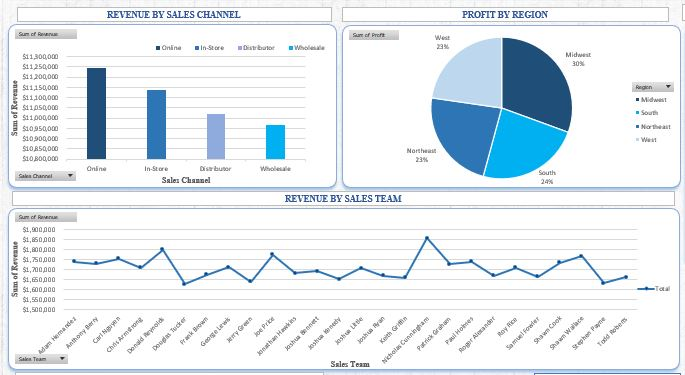

# Sales-Report-Interactive-Dashboard-With-Microsoft-Excel-
The overall efficacy of each sales team's strategy and the effectiveness of each team in converting leads into customers 

Aim: The client is a medium-sized household appliance and interior accessories sales organization that needed to effectively analyze its revenue and profit trend, different product categories, and sales team revenue.
and revenue in each state based on their population and income per state

After being provided with four datasets, namely: sales financial, sales product category, sales team, and sales location table,

Tasks involved:
1.	Assessment of data quality and completeness in preparation for analysis
2.	Targeting high-value customers based on revenue and profit made in different states, sales regions, and product categories
3.	The overall efficacy of each sales team's strategy and the effectiveness of each team in converting leads into customers
4.	Using visualizations to present insights and recommendations

Thereafter, an amazing interactive dashboard was created for the client, and several trends in the underlying data were shown, including revenue by sales channel, profit by region, revenue by sales team, revenue by product category, profit by the top 10 sales teams, revenue and profit by sales date, revenue by states, revenue, median income, and population by state. Data-driven insights and recommendations were generated based on the sales performance of sales reps, sales channel, region, product category, sales date, and state in the United States from visualizations.

Data-driven insights and recommendations on sales performance of sales reps, sales channel,  region, product category, sales date, and state in the United States.

  i.  Nicholas Cunningham Sales Team had the highest sum of revenue and profit with $1,856,248 and $530,357 respectively for the sales period January to May 2020, this reveals the overall efficacy of this team's sales strategy and also the effectiveness of this team in converting leads into customers. 
  
 ii.  Also, 13 out of 26 sales team i.e., 50% had sales revenue above average ($1706,347) showing that the teams are 50% effective in getting to their targets. It is thoughtful that higher expectations and milestones should be set for the sales team in the next sales cycle.
 
iii.  Notably, 5 out of 45 states in the United States namely California, Texas, Illinois, Florida, New York had 51% of the total revenue generated i.e., $22,590 of $44,365, this is at large due to high population (54%) and also high median income (55.6%) of the overall total, hence, sales tactics can involve having more sales targets and sales rep in these states.

iv.  Furthermore, by the sales channel, the highest revenue was generated from the online sales 25.34%, In-store sales had 25.1%,, Distributor Channel 24.8%, and wholesales 24.7%, with all channels showing almost equal effectiveness in sales channel.

 v.  Highest profit was generated in the mid-west region 30%, with the west, south and north east averaging each at 23-24%, this shows a fair distribution of profit across region.
 
vi.  By product category, the decoratives, furniture, and kitchenery made up over 55% ($24,441,588 of $44,365,028) with Decoratives being the top product category with the highest sales revenue ($13,315,202).

vii. Lastly, Sales date period January to May 2020, also had a fairalmost even distribution range between 19-22%.

      In conclusion, this sales report would help to improve sales process, and hit yoursales target and quotas consistently and effectively.

There is a lot more to explore using many different skills of data analytics, such as data cleaning, data modeling, data visualization, problem solving, design thinking, data presentation, and more!
